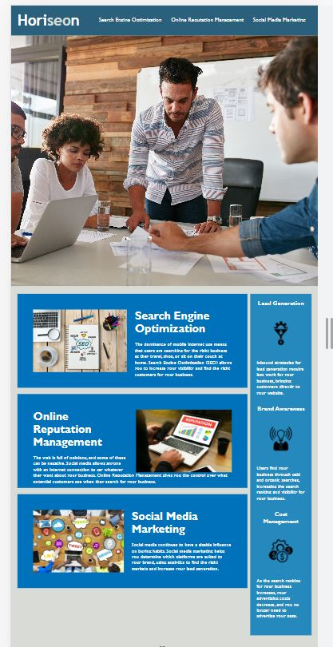

# Challenge1_JW
This is the challenge for week 1. It contains HTML, CSS, and Git practice.

## Project Description
In this project, I changed codes in the following ways:
* Altered div elements to corresponding sematic elements.
* Changed title and page icon.
* Added alt attributes to all icon and image elements.
* Added comments to css file.

## Project Outcome Preview

[Visit my website CLICK here](https://aurorayihe.github.io/Challenge1/)
